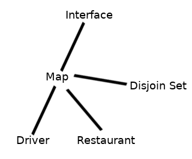

Second stage assignment of [COMPFEST](https://www.compfest.id/) 2019 Software Engineering Academy ([Archived page](https://web.archive.org/web/20190627183033/http://www.compfest.id/academy/sea/)).

Link of the assignment detail can be found [here](https://docs.google.com/document/d/1C5EUZJjNoWGRfgnFb1zD78eWQciSqRs-woFG1vYNT04/edit).

---

# Go-Eat

Thanks for using Go-Eat! Order your food now – all you need to do is just order the food from the restaurant that are available on the apps.

HOW TO USE GO-EAT

1. Select your restaurant – Select your favorite restaurant
2. See the menu and your food cost – We’ll let you know how much the food costs, then ORDER GO-EAT when you’re have done
3. Pay in cash – Currently, Go-Eat only accept cash payment
4. Take the food – Get ready as the nearest driver-partner makes their way to you, then you can take the food that you have already ordered
4. Enjoy the food

## Example Map

MAP LEGEND
R – Restaurant
D – Driver
@ – You

```
# # # # # # # # # # # # # # # # # # # #
# # # # # # # # # # # # # # # # # # # #
# # # # # D # # # # # # # # # # # # # #
# # # #     # #         # # # # # # # #
# # # #                 # # # # # # # #
# # #                       # # # # # #
# #                     R   # # # # # #
# # # R                   # # # # # # #
# # # # D               R   # # # # # #
# # # # #   D                 # # # # #
# # # # #           @       # # # # # #
# # # # #                 D # # # # # #
#     #           # #         # # # # #
#                   # #         # # # #
#                 # # #           # # #
#                 # # #     #       # #
# #                 # # # # # #   D   #
# #                   # # # # # #   # #
# # # #           # # # # # # # # # # #
# # # # # # # # # # # # # # # # # # # #
```

## Usage

There are 3 way to run Go-Eat app

### Without any argument

```
ruby goeat.rb
```

### With file path as it's argument

```
ruby goeat.rb spec/example.toml
```

### With 3 arguments

```
ruby goeat.rb MAP_SIDE_SIZE USER_X_POSITION USER_Y_POSITION
```

e.g

```
ruby goeat.rb 20 10 10
```

There's a border on the map so you can't make the user on the border, in this case USER_X_POSITION as 0 or USER_X_POSITION as 10 (as the coordinate starts from 0).


## Running the test

To make sure the program run correctly, you can try to run

```
rspec
```

## Design choice



- Interface – An interface that bridge the user with the system
  - Map – A map model to generate a random map which contains drivers and restaurants, it also helps the system to decide shortest path or near object
    - Restaurant – Restaurant system with it's menu
    - Driver – Driver system with rating system

### Map generation

When you try to run Go-Eat, the application will generate a random map immediately. The map was generated with [cellular automata map generation](http://www.roguebasin.com/index.php?title=Cellular_Automata_Method_for_Generating_Random_Cave-Like_Levels).

#### How it works

- Create a map (or a rectangle or a 2 dimentional array) with a certain size (`width` x `height`) consist of "wall" as it's elements
- Set up the border, so the border wouldn't be used
- Pick a random `(width * height) * wall_percentage` map element and change them into a floor
- Iterate through all of the map element. If it was a floor and have more than 5 walls surrounding it, change it into wall. If it was not a wall or a wall and have less than 4 wall surrounding it, change it into floor.
- You will have a cave rooms, but it still splitted away, so you have to join it together. In this map generation, I join them together by digging a "tunnel" to the center of map.

**The default map wall density is 40%**

### Path finding algorithm


I use **[Breadth-first search](https://en.wikipedia.org/wiki/Breadth-first_search)** for the shortest path / closest thing stuff. It tranverse through one level of children nodes (the surrounding grid), then tranverse through the level of grandchildren nodes and so on, so it will be good in this case to find out where's the closest driver is, because there's a lot of driver around.

### Why TOML?

I choose TOML simply because it's more human-readable and the format is much more simple especially for the dictionary rather than the other file format like JSON or YAML.

## License

The application is available as open source under the terms of the [MIT License](https://opensource.org/licenses/MIT).
